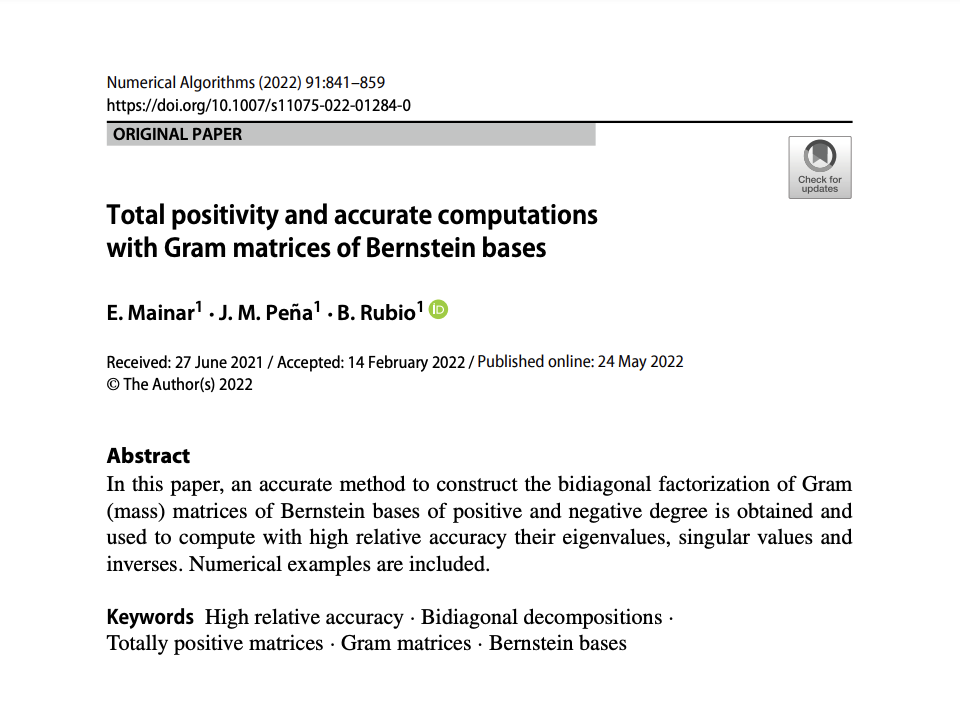

# Total Positivity and Accurate computations with Gram  matrices of Bernstein bases

In this repository, the bidiagonal decompositions (BDA) of the Gram matrices of Bernstein bases of positive and negative degree are provided.

1. In [BD_Gram_Bernstein](https://github.com/BeatrizRubio/GramBernstein_NA2022/tree/main/BD_Gram_Bernstein) the bidiagonal decomposition of Gram matrix of Bernstein basis of positive degree is provided (see formula (30) in [1]). Using this bidiagonal decomposition and the functions available in [2], we also provide methods for solving to high relative accuracy  different problems of Numerical Linear Algrebra with Gram matrices of Bernstein bases of positive degree (see Sections 5 of [1]). The implementation uses Matlab 2022b.

2. In [BD_Gram_Bernstein_Negative_Degree](https://github.com/BeatrizRubio/GramBernstein_NA2022/tree/main/BD_Gram_Bernstein_Negative_Degree) the bidiagonal decomposition of Gram matrix of Bernstein basis of negative degree is provided (see formula (45) in [1]). Using this bidiagonal decomposition and the functions available in [2], we also provide methods for solving to high relative accuracy  different problems of Numerical Linear Algrebra with Gram matrices of Bernstein bases of negative degree (see Sections 5 of [1]). The implementation uses Matlab 2022b.

The implementation uses Matlab 2021b. 

[1] Mainar, E., Peña, J.M. & Rubio, B. Total positivity and accurate computations with Gram matrices of Bernstein bases. Numer Algor 91, 841–859 (2022). https://doi.org/10.1007/s11075-022-01284-0

[2] http://math.mit.edu/~plamen/software/TNTool.html

